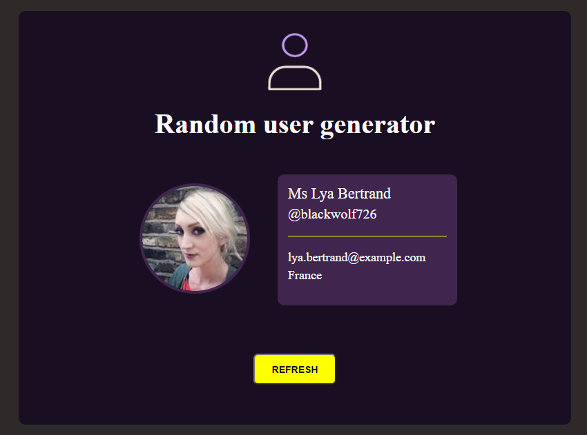

## Table of contents

- [Overview](#overview)
  - [Screenshot](#screenshot)
  - [Links](#links)
- [My process](#my-process)
  - [Built with](#built-with)

## Overview

This is the first project made using the API.
I did it while doing the  [Java Script course on Udemy](https://www.udemy.com/course/kurs-programowanie-w-javascript-od-zera-do-mastera/)
(Mobile version is in progress)

### Screenshot

### Links

- Live Site URL: (https://karbowskam.github.io/random-user/)

## My process

### Built with

- CSS Grid
- SASS
- Gulp
- Java Script (API)
